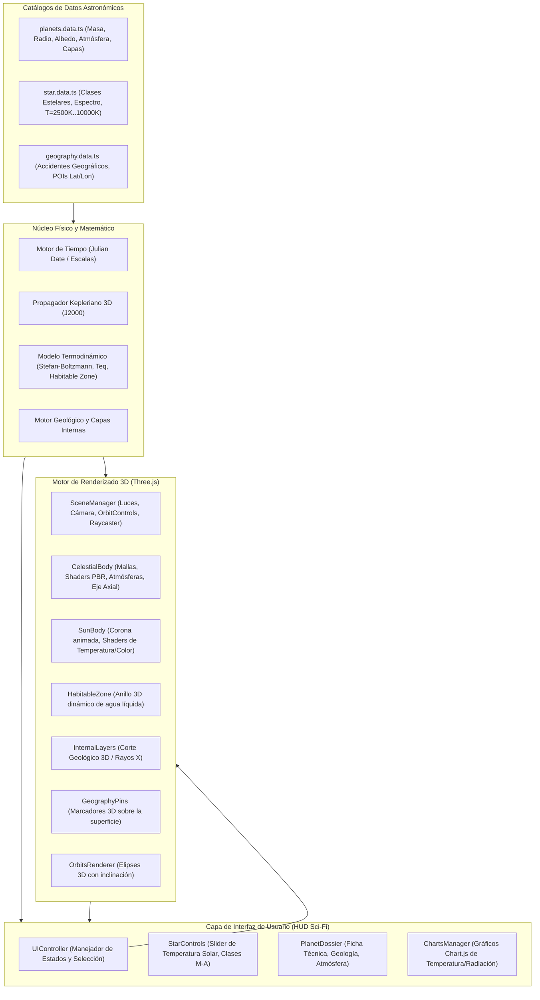

# 🌌 Arquitectura del Sistema Planetario & Simulador Astrofísico 3D

Este documento describe la arquitectura de software, los modelos matemáticos, las ecuaciones físicas, la jerarquía de componentes y el flujo de datos del simulador astrofísico e interactivo del Sistema Solar.

---

## 1. Visión General y Objetivos
El objetivo principal del sistema es proporcionar una plataforma interactiva de **alta fidelidad visual y precisión científica** para el estudio de la mecánica celeste, la termodinámica estelar-planetaria y la geología comparada de los cuerpos del Sistema Solar.

### Capacidades Clave
1. **Mecánica Celeste 3D:** Propagación de órbitas keplerianas elípticas en 3 dimensiones con elementos orbitales J2000 (NASA JPL).
2. **Termodinámica Estelar y Efecto Invernadero:** Cálculo dinámico de la radiación solar incidente ($W/m^2$), temperatura de equilibrio de cuerpo negro ($T_{eq}$), efecto invernadero atmosférico y modulación de la **Zona de Habitabilidad (Goldilocks Zone)** al alterar la temperatura del Sol ($T_\odot$).
3. **Geografía y Geología Planetaria:** Inspección de accidentes topográficos y geológicos con marcadores 3D georreferenciados (latitud/longitud) y corte transversal 3D de capas internas (corteza, manto, núcleo).
4. **Telemetría y Análisis Comparativo:** Gráficos interactivos en tiempo real que relacionan distancia orbital, flujo radiativo y temperatura superficial.

---

## 2. Diagrama de Arquitectura de Software

> Nota: el diagrama describe el espacio "Sistema Solar" (legacy). Los espacios Cielo, Atlas,
> Laboratorio N-cuerpos y Relatividad se detallan en la sección 4.

---

## 3. Modelos Matemáticos y Ecuaciones Físicas

### 3.1. Propagación Orbital Kepleriana en 3D
Para cada cuerpo celeste con elementos orbitales J2000:
- $a$: Semieje mayor ($\text{UA}$)
- $e$: Excentricidad orbital ($0 \le e < 1$)
- $i$: Inclinación orbital respecto a la eclíptica ($^\circ$)
- $\Omega$: Longitud del nodo ascendente ($^\circ$)
- $\varpi$: Longitud del perihelio ($\varpi = \Omega + \omega$)
- $L_0$: Longitud media en la época J2000.0 ($^\circ$)
- $T$: Periodo orbital (días)

#### Pasos de cálculo:
1. **Anomalía Media ($M$):**
   $$M = (L_0 - \varpi) + \frac{360^\circ}{T} \cdot (t - t_0)$$
2. **Ecuación de Kepler (Anomalía Excéntrica $E$):**
   $$E - e \sin(E) = M$$
   Resuelta numéricamente mediante el método iterativo de **Newton-Raphson**:
   $$E_{k+1} = E_k - \frac{E_k - e \sin(E_k) - M}{1 - e \cos(E_k)}$$
3. **Anomalía Verdadera ($\nu$) y Distancia Radial ($r$):**
   $$\nu = 2 \arctan\left( \sqrt{\frac{1+e}{1-e}} \tan\left(\frac{E}{2}\right) \right)$$
   $$r = a(1 - e \cos(E))$$
4. **Vector de Posición en el Plano Orbital y Rotación 3D:**
   En el plano orbital: $\vec{r}_{\text{orb}} = (r \cos\nu, r \sin\nu, 0)^T$.
   Rotación al sistema de referencia heliocéntrico eclíptico:
   $$\vec{r}_{3D} = R_z(-\Omega) R_x(-i) R_z(-\omega) \vec{r}_{\text{orb}}$$

---

### 3.2. Termodinámica Estelar y Radiación Incidente
1. **Luminosidad Estelar ($L_\odot$):**
   Según la **Ley de Stefan-Boltzmann**:
   $$L = 4\pi R_\odot^2 \sigma T_\odot^4$$
   Normalizada con respecto al Sol actual ($T_{\odot,0} = 5778\text{ K}$, $L_{\odot,0} = 1.0\text{ }L_\odot$):
   $$\frac{L}{L_{\odot,0}} = \left(\frac{T_\odot}{5778\text{ K}}\right)^4$$

2. **Flujo / Irradiancia Solar en el Planeta ($S$):**
   A una distancia $d$ (en UA):
   $$S = \frac{S_0}{d^2} \left(\frac{T_\odot}{5778\text{ K}}\right)^4 \quad \text{donde } S_0 = 1361\text{ W/m}^2$$

3. **Temperatura de Equilibrio de Cuerpo Negro ($T_{eq}$):**
   Asumiendo redistribución uniforme de calor y albedo planetario de Bond $A$:
   $$T_{eq} = T_\odot \sqrt{\frac{R_\odot}{2 d_{\text{m}}}} (1 - A)^{1/4} = \left[ \frac{S(1-A)}{4\sigma} \right]^{1/4}$$
   donde $\sigma = 5.670374 \times 10^{-8}\text{ W/m}^2\text{K}^4$.

4. **Temperatura Superficial Real con Efecto Invernadero ($T_{\text{surf}}$):**
   $$T_{\text{surf}} = T_{eq} \cdot (1 + \Delta_{\text{atm}})$$
   donde $\Delta_{\text{atm}}$ es el factor de retención térmica atmosférica dependiente de la densidad y concentración de gases de efecto invernadero (ej. Tierra $\approx +33\text{ K}$, Venus $\approx +500\text{ K}$, Marte $\approx +5\text{ K}$).

5. **Límites de la Zona de Habitabilidad (Goldilocks Zone):**
   Basado en los modelos de *Kopparapu et al.*:
   - **Límite Interior (Efecto Invernadero Desbocado):** $d_{\text{in}} = 0.95 \sqrt{\frac{L}{L_{\odot,0}}}\text{ UA}$
   - **Límite Exterior (Efecto Invernadero Máximo):** $d_{\text{out}} = 1.68 \sqrt{\frac{L}{L_{\odot,0}}}\text{ UA}$
   Al variar $T_\odot$, la zona de habitabilidad 3D se expande o contrae en tiempo real en la escena.

---

### 3.3. Geología Planetaria y Coordenadas Topográficas
Conversión de coordenadas esféricas geográficas $(\text{latitud } \phi, \text{longitud } \lambda)$ a coordenadas cartesianas 3D de la malla planetaria de radio $R$:
$$x = R \cos(\phi) \sin(\lambda)$$
$$y = R \sin(\phi)$$
$$z = R \cos(\phi) \cos(\lambda)$$

Las capas internas se representan como esferas y cuñas concéntricas con radio relativo:
$$r_{\text{capa}} = R_{\text{planeta}} \cdot \left(1 - \frac{\text{profundidad}}{\text{radio total}}\right)$$

---

## 4. Estructura de Módulos del Código Fuente

* `src/core/physics/`:
  * `TimeEngine.ts`: Manejo del tiempo astronómico, fecha juliana y multiplicador de velocidad temporal.
  * `KeplerianEngine.ts`: Algoritmos de solución de Kepler, excentricidad y cálculo vectorial 3D.
* `src/core/thermodynamics/`:
  * `ThermodynamicsEngine.ts`: Ley de Stefan-Boltzmann, irradiancia, temperatura de equilibrio, efecto invernadero y zona de habitabilidad.
* `src/data/`:
  * `planets.data.ts`: Fichas completas de los 8 planetas, Sol, Luna y cuerpos menores.
  * `geography.data.ts`: Accidentes topográficos con lat/lon, altitud y relevancia geológica.
  * `star.data.ts`: Clases espectrales estelares (M, K, G, F, A) y temperaturas.
* `src/render/`:
  * `SceneManager.ts`: Inicialización de Three.js, render loop, iluminación, sombras, raycasting y postprocesado.
  * `CelestialBody.ts`: Generación de mallas planetarias, shaders PBR, atmósferas Fresnel y sombras.
  * `SunBody.ts`: Shaders dinámicos de emisión del Sol según su temperatura en Kelvin.
  * `HabitableZone.ts`: Anillo translúcido con shader radial que delimita la zona habitable.
  * `InternalLayers.ts`: Corte 3D transversal para inspección geológica.
  * `GeographyPins.ts`: Pines interactivos 3D sobre la superficie planetaria.
  * `PostFX.ts`: Postprocesado con EffectComposer + UnrealBloomPass + OutputPass (halo cinematográfico).
  * `Meteors.ts`: Estrellas fugaces ocasionales con desvanecimiento aditivo.
* `src/ui/`:
  * `UIController.ts`: Orquestador de la interfaz de usuario, eventos y modales.
  * `StarControls.ts`: Control interactivo de temperatura solar y tipos de estrella.
  * `PlanetDossier.ts`: Ficha técnica en tiempo real, geología y atmósferas.
  * `ChartsManager.ts`: Gráficos de telemetría con Chart.js.

### 4.1. Módulos de los espacios Cielo, Atlas, Laboratorio y Relatividad

* `src/core/physics/` (adicionales):
  * `NBodyEngine.ts`: Integrador simpléctico leapfrog en unidades SI (baricéntrico) con detección de colisiones, escapes y métricas de conservación; corre en Web Worker.
  * `SkyEngine.ts`: Cielo local desde un sitio observador: alt/az, crepúsculos, salidas/ocasos/culminaciones, magnitudes y fases.
* `src/core/relativity/`:
  * `KerrEngine.ts`: Métrica de Kerr en unidades geométricas: horizonte, ergosfera, ISCO y geodésicas por RK4 con constantes de movimiento.
* `src/core/scientific.types.ts`: Modelo SI común (masas, radios, elementos orbitales) y metadatos de procedencia (observada/derivada/simulada/asumida/visual).
* `src/data/` (adicionales):
  * `exoplanets.data.ts`: Sistemas exoplanetarios curados (modelo SI y procedencia observada/derivada).
  * `brightStars.data.ts`: Estrellas brillantes ICRS J2000 para el espacio Cielo.
* `src/services/` y `src/workers/`:
  * `NasaExoplanetClient.ts` (consulta TAP al NASA Exoplanet Archive), `NBodyWorkerClient.ts`, `nbody.worker.ts`, `kerr.worker.ts`: consulta remota y cómputo pesado fuera del hilo principal.
* `src/render/` (adicionales):
  * `SkyRenderer.ts`: Render 3D del cielo local (horizonte, astros, trayectorias).
  * `MoonFX.ts`: Texturas procedurales de lunas y anillos de órbita (ver GRAPHICS_LAYER.md).
  * `catalogTextures.ts`: Carga de texturas NASA desde `/textures` con fallback procedural.
* `src/ui/` (adicionales):
  * `WorkspaceController.ts`: Orquestador de los espacios Sistema Solar, Cielo, Atlas, Laboratorio y Relatividad.
  * `KerrRenderer.ts`: Visualización GPU aproximada del laboratorio Kerr.
